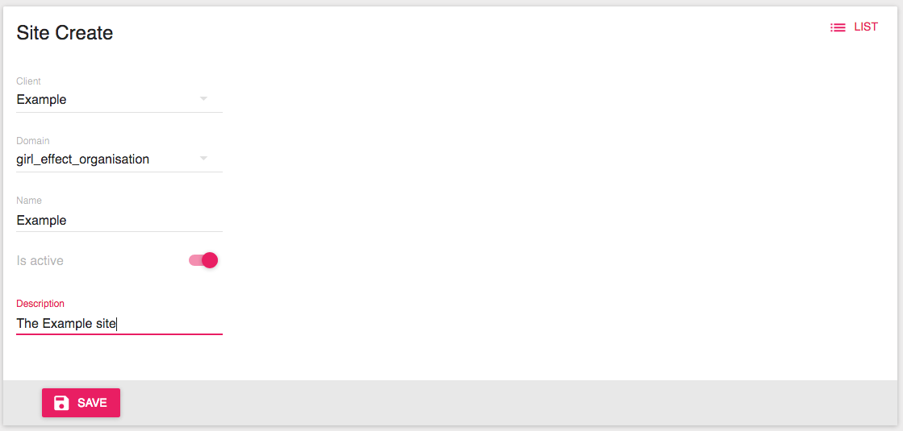

Adding a new application
========================

To add a new application to the Girl Effect infrastructure, a few things need to be set up.

Creating a Client
-----------------

In order for your application to make use of OIDC, you will need to set up a client in the
`Authentication Service <http://authentication-service.qa-hub.ie.gehosting.org/en/admin/oidc_provider/client/add/>`_.

.. figure:: client_creation.png
    :align: center

    The client creation form.

**The fields explained:**

Name
    Whatever you want to call your application.

Client Type
    Select **Confidential**.

Response Type
    Select **Code (Authorization Code Flow)**.

Redirect URIs
    Where you want the Authentication Service to redirect back to after a successful event. An example
    would be http://example.com/oidc/callback/.

JWT Algorithm
    Select the most appropriate for your application.

Require consent
    If your site is accessing any personal information of your user, this should be checked.

Reuse consent
    If you only want to ask for consent on the first login, this should be checked.

Post Logout Redirect URIs
    If you want to have your user return to your site after logging out, you should add the uri. For example: http://example.com.

Creating a Site
---------------

Now that the client has been created, we can set up a site for the client over `here <http://management-portal.qa-hub.ie.gehosting.org/#/sites/create>`_.

    The site creation form.

**The fields explained:**

Client:
    Select the client you just created.

Domain:
    Select a domain most appropriate to your application.

Name:
    Name your site.

Is Active:
    Make active if you want to use your site immediately.

Description:
    Describe your application.

Setting up the data schema for a site
-------------------------------------

.. figure:: schema_creation.png
    :align: center

    The schema creation form.

**The fields explained:**

Site:
    Select the site you have created.

Schema:
    The schema defines what your users' data will look like. The data is validated against this
    schema. `JsonSchema <https://pypi.org/project/jsonschema/>`_ is used to define the schemas.
    A basic schema can be: {"type": "object"}.
