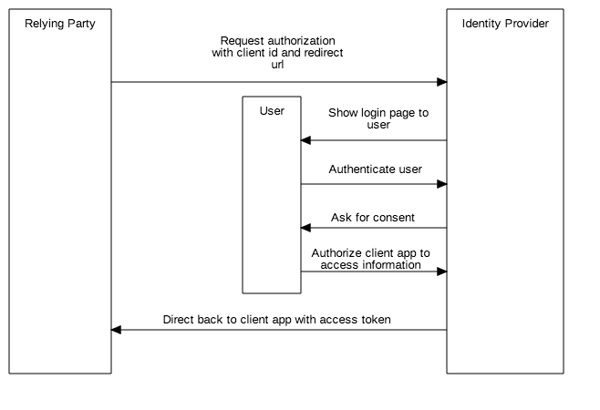

OpenID Connect
==============

What is OpenID Connect?
-----------------------

OpenID Connect (OIDC) is a simple mechanism based on the OAuth 2.0
specification, to allow a client application to contact an identity
provider (IP) in order verify the identities of end-users through
authentication by the Authentication Server, and obtain details of
authenticated sessions and end-users (Connect2id.com, 2018).

OIDC has a lot of the same details that OAuth has, such as the *client_id*, *client_secret*, and *redirect_uri*,
that is stored by the IP to ensure that the information is sent back to the correct client application. This
prevents someone from stealing the *client_id* and using it to have information sent to their own URI (Offenhartz, 2017).

How does OIDC work?
-------------------
An example of a web-based OIDC flow (Auth0, 2018):

1. A client app (Relying Party) sends and authorization request to the Identity Provider (e.g. Google, Facebook, GE Authentication Service).
2. The Identity Provider authenticates the credentials or provides a login screen to the end-user, and asks for authorization (or consent).
3. Once authorized, the Identity Provider sends an access token and an ID token back to the Relying Party.
4. The Relying Party can then use the access token to invoke the services of the Identity Provider.

    OIDC web-based flow (TODO: FIX DIAGRAM TO INCLUDE ID TOKEN)

Access Tokens
-------------
Access Tokens are used to communicate to the API that the bearer of the
token have been authorized to access the API and perform actions that
are permitted by the custom scope of the API (Auth0, 2018).

ID Tokens
---------
TODO

OIDC in Girl Effect
-------------------

TODO: Add examples of the following:

- Django OIDC Provider: https://github.com/juanifioren/django-oidc-provider
- Mozilla Django OIDC: https://github.com/mozilla/mozilla-django-oidc
- Wagtail implementation: https://github.com/girleffect/core-integration-demo/tree/develop/girleffect_oidc_integration

Sources
-------
Auth0. (2018). OpenID Connect. [online] Available at: https://auth0.com/docs/protocols/oidc [Accessed 22 Mar. 2018].

Offenhartz, J. (2017). OpenID Connect explained in plain English.
[Blog] Available at: https://www.onelogin.com/blog/openid-connect-explained-in-plain-english [Accessed 22 Mar. 2018].

Connect2id.com. (2018). OpenID Connect explained | Connect2id. [online] Available at: https://connect2id.com/learn/openid-connect [Accessed 23 Mar. 2018].